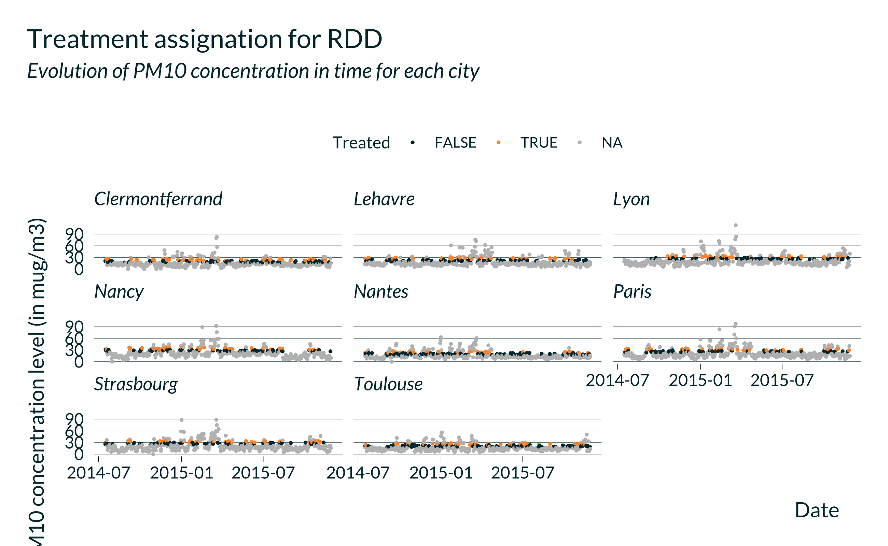

```{r xaringan-themer, include = FALSE}
library(xaringanthemer)
style_mono_light(
  base_color = "#00313C", #1B2754
  text_color = "#00313C",
  background_color = "#F9FAF7",
  header_font_google = google_font("Josefin Sans", "400"),
  text_font_google   = google_font("Lato", "400", "400i"),
  header_font_weight = "bold",
  text_bold_color = "#81402C", #"#B67F10",
  link_color = "#81402C",
  text_font_size = "22px",
  header_h1_font_size = "45px",
  header_h2_font_size = "35px",
  header_h3_font_size = "25px",
  text_slide_number_font_size = "16px"
)
```

## Summary of the main questions

- What is the usual **power** in studies of short-term health effects of air pollution? ✔️
  
- How do **different identification strategies** perform to estimate these effects?
  
- What is the impact of **missing data** on these estimates? 

## Today
  
- Discuss simulations to answer the second question

- Objective: is what we are doing stupid? *ie* not interesting or incorrect $\Rightarrow$ 

```{r echo=FALSE, out.width= 300, fig.align="center"} 

```

---

## Motivation

- Effects are really small $\Rightarrow$ difficult to detect

- "Fancy" techniques developed to avoid omitted variable bias but it may create another type of bias: type M and type S error

- Good exercise for us, PhD students

## Overall method

- Consider RCTs, DiDs, ITSs, RDDs and later IVs and Poisson generalized additive models

1. Assign treatment randomly
1. Create a number of deaths if unit would have been treated (Y(1))
1. Run our estimation
1. Store estimates and p-values
1. Repeat
1. Compute the average bias, power, type M, type S

---

## Data

- 18 cities in France 

- 2013-2018 

- Hospital admissions and deaths 

- Air pollution concentration 

- Weather variables 

- Calendar control variables 

- Daily and city level: a unique observation per date and per city in the data set

---

## Background on selected designs

### RCT

- Changes in air pollution levels on some random days. 

- Example: transportation strikes 

- Compares the average number of deaths in cities with treatment to cities with no treatment on the same day, controlling for differences across cities.

```{r echo=FALSE, out.width= 500, fig.align="center"} 
knitr::include_graphics("images/treat_assign_RCT.png")
```

---

### DID

- Changes in air pollution levels in a subset of cities after a given date. 

- Example: change in regulations at a sub-national level 

- Same comparison as RCT but non-random treatment assignment 

```{r echo=FALSE, out.width= 600, fig.align="center"} 
knitr::include_graphics("images/treat_assign_DID.png")
```

---

### ITS

- Changes in air pollution levels in all cities after a given date

- Example: change in regulations at a national level 

- Compare the average number of deaths before and after treatment.

```{r echo=FALSE, out.width= 600, fig.align="center"} 
knitr::include_graphics("images/treat_assign_ITS.png")
```

---

### RDD

- Interventions that affect exposure to air pollution when air pollution levels reach a given threshold 

- Examples: air pollution alerts

- Compare days just below the threshold to days just above the threshold 

```{r echo=FALSE, out.width= 600, fig.align="center"} 

```

---

## Varying “parameters”

- Identification strategy: RCT, DID, RDD, ITS

- Number of observations: length of the study, in days

- Proportion of treated days: can be very small (eg the number of strikes)

- Effect size

- The estimation model: first no covariates. Then include different sets of covariates.

- Here, ideal case: random treatment allocation, perfect compliance and homogeneous treatment effect

---

## Actual implementation 

1. Draw study period:
  - Number of days in the study $\to$ boolean in study/not in study
  - Random draw

1. Define the treatment: 
  - Design and proportion of treated $\to$ boolean treated/not treated
  - Already explained

1. Creating the output if a unit is treated:
  - Data, design and effect size $\to$ Y(1)
  - New number of deaths = actual number of deaths + draw from a Poisson distribution (with mean equal to the number of deaths $\times$ effect size in percent)

1. Estimate the model:
  - Data and model "formula" $\to$ estimate and p_value
  
---

1. Loop over $n_iter$ iterations:
  - Source of variation: for each iteration, a new sample (new study period) and new treated group

1. Repeat for all parameters:
  - For each set of parameters, get $n_{iter}$ estimates and p-values

1. Analysis of the results:
  - For each set of parameters, compute average bias, p-value, power, type M and type S
  - Can study how bias, precision, power, type M, type S evolve with the values of parameters

---

## Deviation from the ideal case

| Allocation                  | Compliance   | Effect of the treatment  |
|:----------------------------|:------------:|-------------------------:|
| Random                      | Yes          | Homogeneous              |
| Random                      | No           | Homogeneous              |
| Correlated with covariates  | Yes          | Homogeneous              |
| Random                      | Yes          | Heterogeneous            |

- For non-random allocation:
  
  1. Correlation with different covariates
  1. Of various form
  1. Of various intensity

- Variation of the treatment effect with: 

  1. Time
  1. Individuals
  1. Value of covariates


