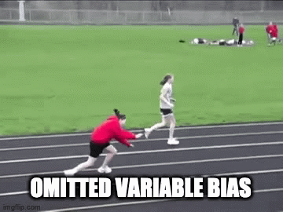

```{r include=FALSE}
library(tidyverse)
library(retrodesign)
library(mediocrethemes)
library(AER)
library(ggridges)

set_mediocre_all()
set.seed(1)
```


```{r xaringan-themer, include = FALSE}
library(xaringanthemer)
style_mono_light(
  base_color = "#00313C", #1B2754
  text_color = "#00313C",
  background_color = "#F9FAF7",
  header_font_google = google_font("Josefin Sans", "400"),
  text_font_google   = google_font("Lato", "400", "400i"),
  header_font_weight = "bold",
  text_bold_color = "#FB9637", #"#B67F10",
  link_color = "#FB9637",
  text_font_size = "30px",
  header_h1_font_size = "52px",
  header_h2_font_size = "42px",
  header_h3_font_size = "32px",
  text_slide_number_font_size = "16px"
)
```

# Genesis

- Worked on a related project on air pollution

--

- We noticed the existence a key trade-off between identification strategy and statistical power

```{r echo=FALSE, out.width= 550, fig.align="center"} 
knitr::include_graphics("images/book.gif")
```

---

# Type M error

--

```{r echo=FALSE, fig.height= 4.3, fig.width=9, out.width=1200, dpi = 700}
rnorm(5000, 0.5, 1) %>% 
  as_tibble() %>% 
  mutate(
    n = row_number(),
    non_significant = dplyr::between(
      value, 
      - 1.96*sd(value), 
      1.96*sd(value)
    ),
    significant = ifelse(non_significant, "Non significant", "Significant") 
  ) %>% 
  ggplot(aes(x = n, y = value, color = significant)) + 
  geom_point(alpha = 0.8) +
  geom_hline(aes(yintercept = mean(value)), linetype = "dashed", color = "#FB9637") +
  # geom_hline(aes(yintercept = 1.96*sd(value)), color = "#FB9637") +
  # geom_hline(aes(yintercept = - 1.96*sd(value)), color = "#FB9637") +
  labs(
    title = "Illustration of type M and S errors",
    subtitle = "5000 draws of an estimate ~ N(0.5,1)",
    x = "Draw",
    y = "Point estimate"
  ) +
  scale_color_discrete(name = "") + 
  theme_mediocre(background = TRUE)
```

---

# Overview of the central issue in this project

.pull-left[

1. We fear omitted variable biases

1. We develop neat identification strategies

1. It sometimes lead to low power

1. It creates type M error

1. The value obtained is wide of the mark of the true effect

]

--

.pull-right[
.center[  ]
]

---

# Objective of the paper

- Highlight the existence of this trade off between omitted variable bias and type M error

--

# Objectives of this presentation

--

- Is this objective a decent one? 

--

- Should we add other objectives?

--

- What could/should we do to reach it?

---
class: inverse, middle, center

# Why could some identification strategies lead to low power?

---

- **RDD**: 

--
  
  - When $\searrow$ bandwidth,
--

  - omitted variable bias $\searrow$
--

  - **BUT** number of observations also $\searrow$ 
--

  - so power $\searrow$ 
--

  - type M error $\nearrow$
  
--

- **RCT**:

--

  - No omitted variable bias
--

  - if sample size or effect too small, may still get a statistically significant estimate 
--
  
  - **BUT** it would overestimate the "true" effect
--

  - (Not the most interesting case for our issue)

---

- **IV**:

--

  - Imprecise

```{r echo=FALSE, fig.height=4.3, fig.width=9, message=FALSE, warning=FALSE, fig.align='center', dpi=700, out.width=750}
IVsamD <- function(sample_size, coef_Z, viol = 0) {
  num_loops = 500
  #sample_size = 30
  #coef_Z = 0.5
  OLS_biased <- numeric(num_loops)
  OLS_unbiased <- numeric(num_loops)
  IV <- numeric(num_loops)
  for (i in 1: num_loops) {
    U <- runif(sample_size,
               min = 1, max = 5)
    Uy <- rnorm(sample_size)
    Z <- runif(sample_size,
               min = 1, max = 5) + viol*Uy
    X <- U + rnorm(sample_size) + coef_Z *Z
    Y <- U + X + Uy
    OLS_biased[i] <- summary(lm(Y ~ X))$coef[2]
    OLS_unbiased[i] <- summary(lm(Y ~ X + U))$coef[2]
    IV[i] <- summary(ivreg(Y ~ X | Z))$coef[2]
  }

  reg_IV <- tibble(OLS_biased, OLS_unbiased, IV)
  reg_IV
  
  reg_IV_s <- reg_IV %>%
    gather(Estimator,value,OLS_biased:IV)
  reg_IV_s
  
  ggplot(reg_IV_s, aes(value, colour = Estimator, fill = Estimator)) +
    geom_density(alpha = 0.05) +
    xlim(c(-1,2)) +
    geom_vline(xintercept = 1, lty = 2) +
    labs(
      title = "Sampling distributions of different estimators",
      subtitle = "Fake data simulations",
      x = "Point estimate", 
      y = "Density"
    ) +
  theme_mediocre(background = TRUE)
}

IVsamD(sample_size = 30, coef_Z = 1, viol = 0)
```

--

  - Lower power, higher type M error
  
<!-- --- -->

<!-- - **DID**:  -->

---
class: inverse, middle, center

# How to illustrate this trade off?

---

# Fake data simulations

--

- Very simple: y, x, binary treatment, omitted variable bias

--

- Different simulations for each identification strategy

--

- **RDD**: variation of omitted variable bias and type M with bandwidth

--

- **RCT**:
  - Kills omitted variable bias
  - Evolution of type M with number of observations and effect size
  
--

- **IV**:
  - Compare omitted variable bias in OLS and type M in IV
  - Vary strength of the instrument

---

# Your opinion

.pull-left[

- **Objective**: highlight the existence of this trade off between omitted variable bias and type M error

- Is this objective a decent one? 

- Should we add other objectives?

- What could/should we do to reach it?

]

.pull-right[
.center[  ]
]

---
class: inverse, middle, center

# Thank you


